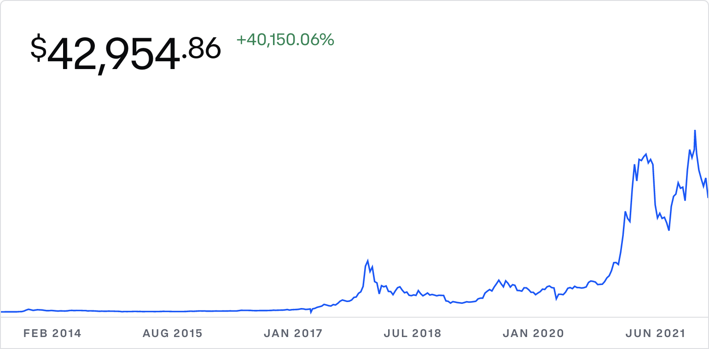

Bitcoin has had a meteoric rise 🚀.  
In 2021, bitcoin gained 63%. 
In 2020, bitcoin gained a whopping 300%! 
In 2019, bitcoin gained 96%. 
In 2018, bitcoin lost a whopping 72%! 
In 2017, bitcoin surged a crazy 1337%!!!

Bitcoin's market capitalization has surged massively over the pass few years and now
fluctuates around the <u>1 trillion</u> dollar market capitalization. Even as the largest 
cryptocurrency in terms of market capitalization and about double the market capitalization
of the second largest cryptocurrency Ethereum, it still remains one of the most volatile
assets when compared with traditional equities.

With such a great run Bitcoin has had, is it still worth investing in it in 2022?

### What is Bitcoin's value?

If you don't already know, Bitcoin is the first ever cryptocurrency created and solves two
out of the three problems within the cryptocurrency trilemma - decentralization and security.
Bitcoin's downside is in its speed. Other cryptocurrencies created since then have aimed
to tackle and improve on the solution to this trilemma.

Because of its speed, it lacks real world value because it fails as a payments processor.
Also, it lacks other utilities that other cryptocurrencies have like smart contracts. As such,
investors often value Bitcoin as a store of value - in other words, they view it as digital gold.

### Bitcoin's Limited Supply - 21 Million

Bitcoin is deflationary in nature because of its limited supply of 21 million Bitcoins that will
ever be circulated in the market. This means that as long as there is increasing interest in
the asset, the price should theoretically go up over time.

As institutions and funds start loading up their balance sheets with cryptocurrency, they would
most certainly have an allocation towards Bitcoin. The interest for cryptocurrency in general
will only go up over time as it becomes a more recognized asset (than it already is). The launch
of the first U.S. Bitcoin futures ETF last year was yet another step towards its adoption.

### The Slowing Supply of Bitcoins - Bitcoin Halving

Bitcoin uses a Proof of Work (PoW) mechanism as a means to validate transactions. Simply put,
people are required to use their computers to solve an extremely hard mathematical problem (that
can only be brute forced) to validate the legitimacy of transactions before the transaction
can be put on the blockchain ledger. Essentially, people (a.k.a. Bitcoin miners) are rewarded
with Bitcoin for their work that they put in to support the blockchain.

Bitcoin halving is the phenomenon where the reward given to Bitcoin miners for validating
transactions are halved. This phenomenon happens after every 210,000 blocks, or roughly 4 years.
This cuts the rate at which Bitcoin is released into the open market by half, thereby reducing
supply in that sense.

As demand in cryptocurrency (and consequently Bitcoin) grows, a slowing supply of Bitcoin will
undoubtedly have a synthetic price inflation. Halving has historically (in 
[2012, 2016 and 2020][halving-increase]) caused the price of Bitcoin to surge massively over a
short period of time, which indicates that scarcity of the asset does yield inflationary pressures.

### Bitcoin's Environmental Impact

Because of the cryptographic hashing problem that Bitcoin miners are required to solve, the energy
of the entire Bitcoin network is estimated in 2021 to consume roughly 93 terawatt hours (TWh) of
electricity per year. That's how much energy the entire country of Phillipines, the 33rd largest
electricity consumer consumes in a year!

Despite how much energy the network consumes, it provides transparency and measurability into its
energy consumption unlike traditional fiat systems where ATM machines, bank branches, storage
facilities and what not cannot be quantified efficiently.

Nonetheless, it may be something you may want to think about when investing in a decentralized
asset like Bitcoin.

### What This All Means To Me

Personally, as much as investors see Bitcoin as digital gold, the recent fears over inflation have
derailed not only the markets in traditional finance but also digital assets like cryptocurrency,
including Bitcoin. This signals to me that Bitcoin - this so-called "digital gold" - is far from a
safe haven asset that investors would usually flock to.

As an investor, I do believe cryptocurrency provides the diversity that one should have in their
portfolio. The question here is: Does ***Bitcoin*** make it to that asset allocation?

The answer for me is: **Yes**.

Even though it is far from a safe haven asset, I believe institutional (and even retail) adoption
will only continue to increase and this demand from institutions will drive up the price of Bitcoin
in 2022. Be it retail or institutions, Bitcoin will always be one of the top cryptocurrency picks
due to its long establishment and more importantly *familiarity*.

That being said, I <u><b>would not</b></u> buy Bitcoin at current prices as I believe there is
further downside that will spill over from the inflation woes that will persist over the coming
months. I believe Bitcoin has passed the stage of triple-digit growth per year, but buying the dip
when inflation fears kick in will still give a sizable return. A high double-digit return is
still a decent return that will likely outperform any traditional equities by a mile.

### Closing Words

> **Full disclosure**: 
> I do not personally own any Bitcoins at the time of writing.

Finally, if you like what you read, do support me by buying me a 🍺
[here](https://www.buymeacoffee.com/davidcjw)! :) Cheers!

[halving-increase]: https://www.investopedia.com/bitcoin-halving-4843769#:~:text=The%20first%20Bitcoin%20halving%20occurred,to%20occur%20in%20early%202024.
