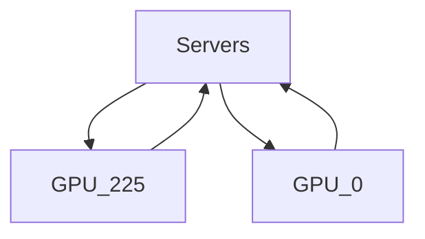
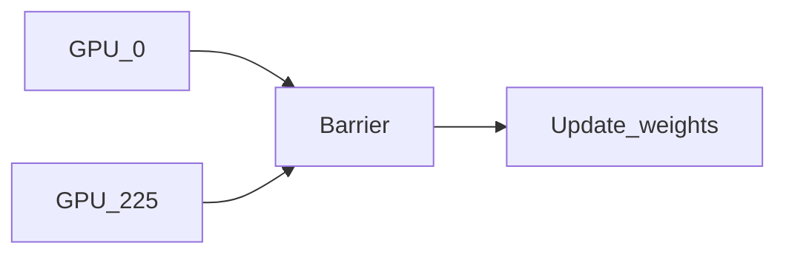

## Chapter 6: Model Development and Offline Evaluation
### Experiment Tracking
In theory, good to log everything possible (loss curve, model performance, speed, system performance, hyperparameters, etc) but in practice it will be too overwhelming.

**Takeaway**: Log what makes sense to you -> more is better than less but don't overdo it.

### Versioning
Things to version:
- Models -> DVC
- Data -> DVC
- Code -> Git

Data versioning is like flossing - everyone agrees it's a good thing to do, but few do it.

Data versioning is hard because:
1. Data is much harder than code. What then, defines a "version"? Code is easy to track because we can track lines changed, but when it comes to data, do diffs mean changes in the content of any file in your data repository, only when a file is removed or added, or when the checksum of the whole repository has changed?
2. Different versions of data can't be merged together like code -> there is no corresponding model unless this merged data is trained on a model.
3. Regulations like GDPR make versioning complicated

### Distributed Training
Training models on multiple machines when not all your data can fit in memory

New terminology: **Gradient checkpointing**

#### Data Parallelism
Split data into chunks and train model on different chunks and accumulate gradients.

Two possible ways:
1. Asynchronous Stochastic Gradient Descent (SGD)
2. Synchronous Stochastic Gradient Descent (SGD)

<ins>Asynchronous SGD</ins>

Here, model gradients are updated as and when one machine finishses computation. 

Problem: Gradient staleness might become a problem because the gradients from one machine have caused the weights to change before the gradients from another machine have come in.

<ins>Synchronous SGD</ins>

Here, the model weights for gradients from multiple machines to compute, accumulates then before updating.

Problem: Stragglers will cause the entire system to slow down, wasting time and resources. This problem becomes more apparent with more machines and more workers.

#### Model Parallelism
Different components of the model are trained on different machines (e.g., split input matrix, split by layer, etc).

Input matrix computation can be split on different machines and trained in parallel. However, splitting by layers must wait for one layer to finish calculating before it can be fed into the second machine.

Read about pipeline parallelism in the book. A bit hard to execute in real life -> require a lot of engineering effort.

### AutoML
Most crucial component in AutoML is compute power. The premise is to replace Data Scientists with raw compute power to search through the search space rather than a Data Scientist's intuition.

#### Hyperparameter Tuning

Most fundamental example of AutoML is hyperparameter tuning (tuning parameters of a classifier) -> grid searching a set of parameters to get the best model that performs on a validation set.

> NOTE! Never do hyperparameter tuning on test set, lest overfitting on it.

#### Architectural Search
Brute force searching of a neural network's architecture (by giving it some fundamental structure it should follow).

#### Optimizers
Instead of specifying a fixed hand written optimizer like Adam, Ada, SGD, etc, use a learned optimizer-an optimizer that learns from an existing set of tasks.

In theory it can be endless -> a learned optimizer can be used to train another learned optimizer.

<ins>Examples</ins>

EfficientNet developed by Google's AutoML team surpassed the SOTA accuracy with 10x efficiency.

---

## References
- [Link Title](Link)